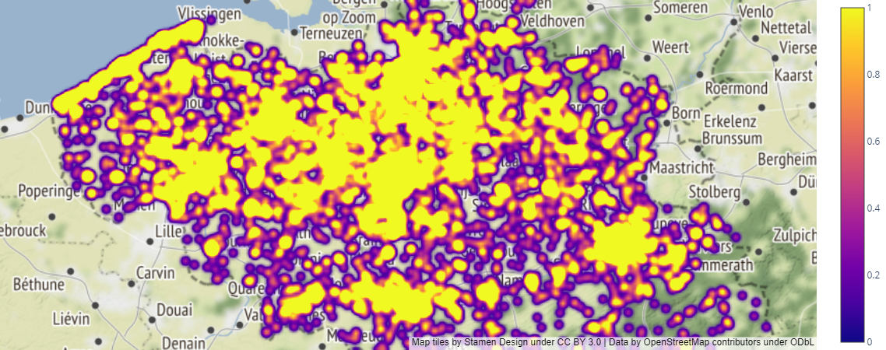
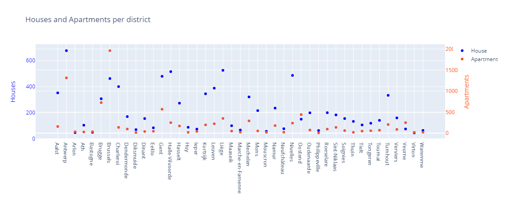
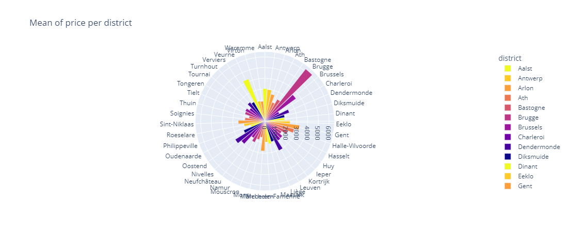

# Immo Eliza - Data Analysis

A solo project @ [BeCode.org](https://becode.org/) as part of the **AI Bootcamp** in Gent

## Project description

This is the second stage of a larger project to create a Machine Learning (ML) model to predict sell prices of real estate properties in Belgium.

The current task is to clean the actual data (at least 19,000 entries) of the Belgian real estate market. These data will be used to display graphs and do model analysis.

The dataset used a `csv` file scraped from [ImmoWeb](https://www.immoweb.be/en) website, which was provided from the  [ImmoEliza-DataScraper](https://github.com/vitaly-shalem/ImmoEliza-DataScraper) project.

## Installation

1. Clone [Immo Eliza Data Analysis](https://github.com/mendoce24/immo-eliza-data-analysis) repository
2. Change directory to the root of the repository
3. Install required libraries by running `pip install -r requirements.txt`

## Usage

- Within Jupyter Notebook  `immo_eliza_data_analysis.ipynb` you will be able to navigate and consult the different graphs.
- The following graphics were generated with Plotly, as part of the analysis of the data provided.

## Timeline

This stage of the project lasted 5 days in the week of July 05-11, 2023.

## The Team

The stage was made by:

- César E. Mendoza V. [LinkedIn](https://www.linkedin.com/in/mendoce24/) | [GitHub](https://github.com/mendoce24)

## Instruction

The stage was made under the supervision of [Vanessa Rivera Quiñones](https://www.linkedin.com/in/vriveraq/) and [Samuel Borms](https://www.linkedin.com/in/sam-borms/?originalSubdomain=be)

Gent | July 11, 2023
