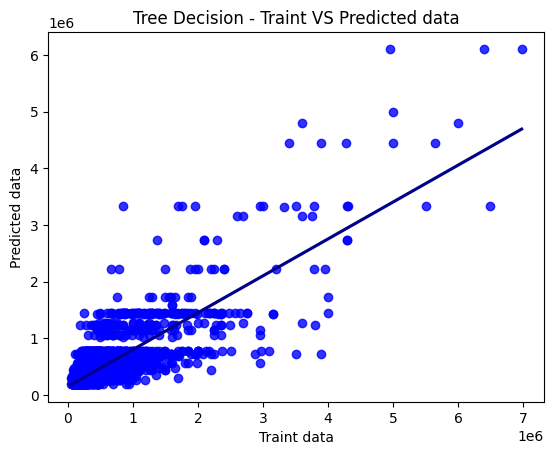

# Immo Eliza - Data Analysis

A solo project @ [BeCode.org](https://becode.org/) as part of the **AI Bootcamp** in Gent

## Project description

This is a project to create a Machine Learning (ML) model to predict sell prices of real estate properties in Belgium.

The previous task was to clean the data (at least 19,000 entries) of the Belgian real estate market. These data was used to display graphs and do model analysis.

Also maked the analysis and exploration of the date to build a model to predict de sell price of the properties.

Now with the implementation of an API made with FastAPI, the prediction of a property price can be consulted, inserting the data required for the calculation and obtaining the information shown below as a result. 
```json
{
  "prediction": Optional[float],
  "status_code": Optional[int]
}
```
The dataset used a `csv` file scraped from [ImmoWeb](https://www.immoweb.be/en) website, which was provided from the  [ImmoEliza-DataScraper](https://github.com/vitaly-shalem/ImmoEliza-DataScraper) project.

## Installation

1. Clone [Immo Eliza Data Analysis](https://github.com/mendoce24/immo-eliza-data-analysis) repository
2. Change directory to the root of the repository
3. Install required libraries by running `pip install -r requirements.txt`

## Usage
### Data Exploration
- Within Jupyter Notebook  `immo_eliza_data_analysis.ipynb` you will be able to navigate and consult differents graphs.
- The following graphics were generated with Plotly, as part of the analysis of the data provided.

Map Belgium           |  Amount Properties per district
:-------------------------:|:-------------------------:
 | 
Price per district |
 |

### Model Building
- Within Jupyter Notebook  `immo_eliza_data_exploration_categorical.ipynb` you will be able to navigate and consult differents graphs and methos to clean the data and prepared to be usefull to the model, in this version we used also the categorical data to used in the model.
- Within Jupyter Notebook  `immo_eliza_data_building.ipynb` you will be able to perform the model prediction we used four different models to find the best way to obtain the maximum prediction score.
When carrying out the model with the different regression methods we can obtain better results with Random Forest Regressor.

Linear Regression (Test Score: 0.39)            |  XGB Regressor (Test Score: 0.62)
:-------------------------:|:-------------------------:
  | 
Tree Regressor (Test Score: 0.67)             |  Random Forest Regressor (Test Score: 0.67)
  | 

### Deployment
- Whit the file `app.py` you can call the API, which will provide you with the structure of the data to query via the `GET` predict method, and with a `POST` predict method, you can query the price prediction of a property entered as input parameter
- As imput the API is goint to recibe:
```json
{
  "data": {
    "transactionSubtype": str
    "type": "APARTMENT" | "HOUSE"
    "subtype": "APARTMENT" | "GROUND_FLOOR" | "PENTHOUSE" | "DUPLEX" | "FLAT_STUDIO" | "HOUSE" | "VILLA" | "TRIPLEX" | "BUNGALOW" | "COUNTRY_COTTAGE" | "APARTMENT_BLOCK" | "SERVICE_FLAT" | "LOFT" | "MIXED_USE_BUILDING" | "TOWN_HOUSE" | "MANSION" | "KOT" | "EXCEPTIONAL_PROPERTY" | "FARMHOUSE" | "MANOR_HOUSE" | "CASTLE" | "CHALET" | "OTHER_PROPERTY"
    "region": "Flanders" | "Wallonie" | "Brussels"
    "province": "Limburg" | "Walloon Brabant" | "Liege" | "Antwerp" | "East Flanders" | "West Flanders" | "Brussels" | "Flemish Brabant" | "Hainaut" | "Namur" | "Luxembourg"
    "floor": int
    "bedroomCount": int
    "netHabitableSurface": int
    "constructionYear": int
    "facadeCount": Optional[int]
    "floorCount": int
    "condition": "AS_NEW" | "GOOD" | "TO_BE_DONE_UP" | "JUST_RENOVATED" | "TO_RENOVATE" | "TO_RESTORE"
    "hasLift": Optional[int]
    "kitchen": "USA_INSTALLED" | "HYPER_EQUIPPED" | "USA_HYPER_EQUIPPED" | "INSTALLED" | "SEMI_EQUIPPED" | "NOT_INSTALLED" | "USA_SEMI_EQUIPPED" | "USA_UNINSTALLED"
    "hasGarden": Optional[int]
    "gardenSurface": Optional[int]
    "hasTerrace": Optional[int]
    "terraceSurface": Optional[int]
    "fireplaceExists": Optional[int]
    "hasSwimmingPool": Optional[int]
    "hasAirConditioning": Optional[int]
    "bathroomCount": int
    "showerRoomCount": int
    "toiletCount": int
    "parkingCountIndoor": Optional[int]
    "parkingCountOutdoor": Optional[int]
    "primaryEnergyConsumptionPerSqm": Optional[int]
    "epcScore": "A++" | "A+" | "A" | "B" | "C"  | "D" | "E" | "F"
    "hasDoubleGlazing": Optional[int]
  }
}
```
```json
{
  "prediction": Optional[float],
  "status_code": Optional[int]
}
```
- And it is going to return:


## Timeline

Third stage of the project lasted 3 days in the week of July 26-28, 2023.

Second stage of the project lasted 4 days in the week of July 17-20, 2023.

First stage of the project lasted 5 days in the week of July 05-11, 2023.

## The Team

The stage was made by:

- César E. Mendoza V. [LinkedIn](https://www.linkedin.com/in/mendoce24/) | [GitHub](https://github.com/mendoce24)

## Instruction

The stage was made under the supervision of [Vanessa Rivera Quiñones](https://www.linkedin.com/in/vriveraq/) and [Samuel Borms](https://www.linkedin.com/in/sam-borms/?originalSubdomain=be)

Gent | July 20, 2023
